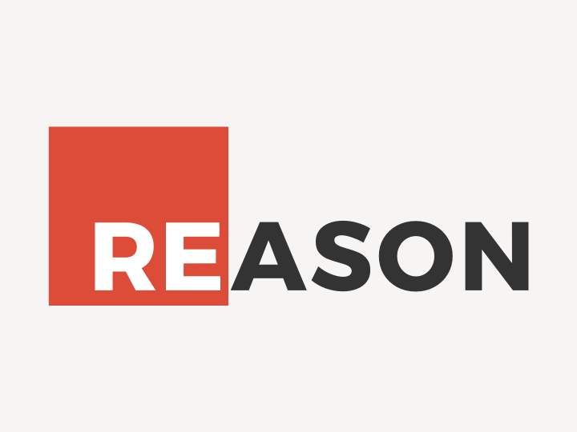

В жизни программиста наступают такие моменты, когда ты осознаешь потребность в изучении чего-то
нового. Это может быть что угодно: новая библиотека, фреймворк или язык программирования.

Такая потребность связана с тем, что при творческом выгорании на работе со знакомыми инструментами,
нервная система хочет пуститься в авантюру и изучить новое.

## Постановка задачи и выбор кандидатов

Найти язык программирования, который отвечает следующим требованиям:

* есть функциональная парадигма
* иммутабельность переменных
* строгая типизация
* возможность работать с экосистемой js (устанавливать npm пакеты)
* трансплитерация в js код
* есть коммерческая поддержка

Возможные кандидаты, которые хоть немного на слуху:

* ClojureScript
* TypeScript
* Elm
* PureScript
* BuckleScript
* ReasonML

### ClojureScript

ClojureScript — это Clojure, который транслируется в JavaScript. Если говорить о самом Clojure, то
это современный диалект Лиспа, является языком программирования общего назначения с поддержкой
разработки в интерактивном режиме, поощряющий функциональное программирование.

Появился в 2012 году и повлиял на становление других языков, которые реализовывали типы в JS:
например на TypeScript.

К сожалению, в последнее время испытывает сложности и вряд ли будет расти дальше, судя по Google
Trends.

### TypeScript

Язык программирования, который был создан в лабораториях Microsoft. Изначально вобрал в себя лучшее
из двух миров: JS и C#. Но ориентация идет более на JS, т.к. данный язык является обратно
совместимым с JS. Это позволяет очень быстро начать внедрять TypeScript на уже существующих
проектах.

Появился в 2012 году и очень стремительно развивается. Такое развитие, скорее, связано с
использованием его во фреймворке Angular 2+, разрабатываемым Google.

Я очень много на нем проектов сделал, отличный язык позволяющий явно указывать типы и проверять их
на этапе компиляции. Спасал меня много раз от "выстрелов себе в ноги".

### Elm

Интересный язык программирования, который наделал много шума в 2016 году. Чем он так отличился от
других? А тем, что автор заявил то, что с этим языком программирования не будет исключений в
runtime. Это о том, о чём многие мечтают до сих пор.

Но, есть во всем этом ложка дегтя: данный язык насаждает только одну архитектуру, которая возведена
в абсолют, как единственно возможная. Да, такая диктатура делает все приложения легко понятными для
всех. Но, такое ограничение не для меня, мне приходится часто писать код на бэкенде, а данный язык
мне с этим помочь не может.

### PureScript

Тот самый кандидат, который мне понравился по нескольким критериям. Он полностью функциональный -
наследник Haskell, самого чистого функционального языка. Популярный судя по трендам.

Думаю его попробовать изучить.

### BuckleScript

Транслятор OCaml в JS.

### ReasonML

Разработан недавно в компании Facebook. Наследник OCaml, который транслируется в JS через
BuckleScript. Говоря о OCaml, данный язык очень популярен среди разработчиков Facebook, они им часто
вдохновляются и создают такие крутые проекты, как React и т.д.

По слухам, они создают транслятор JS -> ReasonML. И это немного обескураживает. С таким
инструментом, можно очень быстро "склонировать" экосистему JS.

Начну с данного языка, т.к. он ближе по требованиям ко мне.

## Резюмируя

Подводя итог, я хочу сказать, что я для себя выбрал пару языков, которые буду изучать в свободное от
работы время на домашних проектах. Первый язык это ReasonML, он фаворит по требованиям, а второй
PureScript, который мне также симпатичен.
